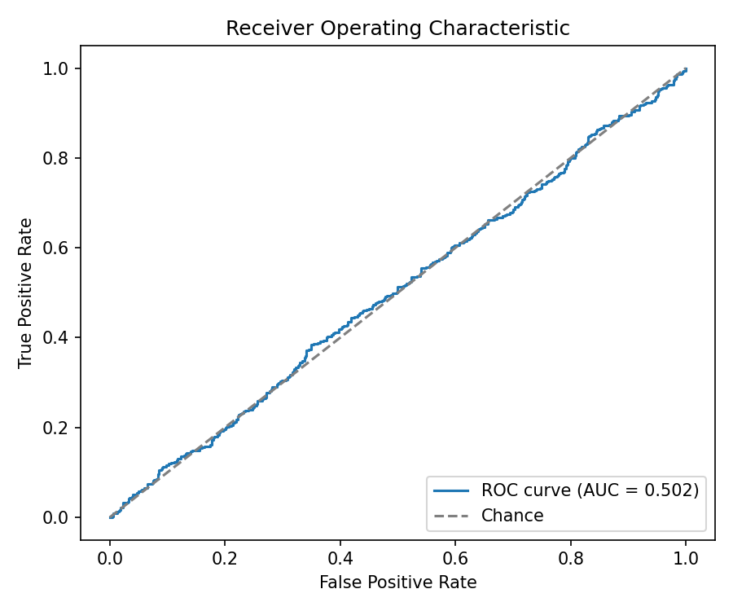
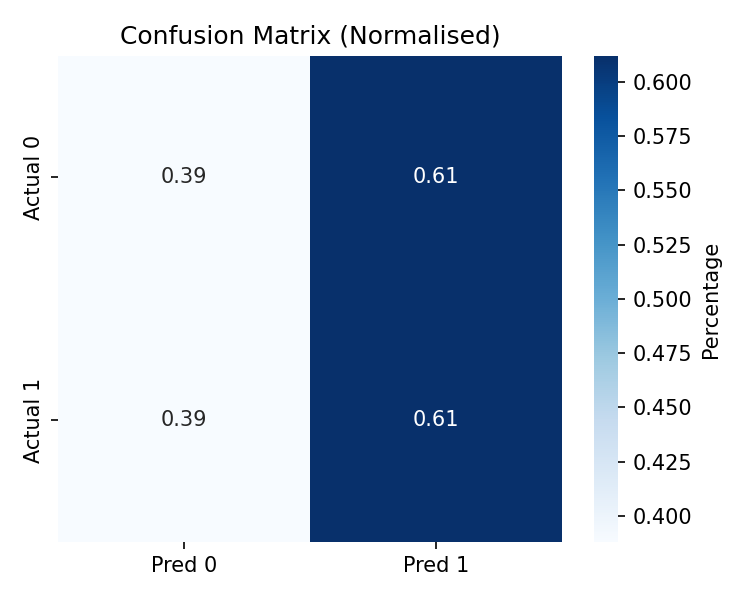

# Diabetes Prediction Model

This project trains a binary classifier that predicts diabetes risk using the **Diabetes Prediction (India)** dataset from [Kaggle](https://www.kaggle.com/datasets/aasheesh200/diabetes-dataset).

## Project structure

- `src/diabetes/` – reusable data loading and model utilities
- `src/train.py` – command-line entry point for training & evaluation
- `requirements.txt` – Python dependencies
- `models/` – default directory for exported models (created at runtime)

## Getting started

1. **Get the dataset**
   - Download the Kaggle CSV (`diabetes_prediction_india.csv`) and place it at `data/diabetes.csv` inside this project.

2. **Create and activate a virtual environment**
   ```bash
   python3 -m venv .venv
   source .venv/bin/activate
   ```

3. **Install dependencies**
   ```bash
   pip install -r requirements.txt
   ```

4. **Train & evaluate**
   ```bash
   PYTHONPATH=$PWD/src python -m src.train --data-path data/diabetes.csv --output-dir models
   ```

   The script will:
   - Load and clean the dataset (numeric casting + categorical normalisation)
   - Split into train/validation sets
   - Train a scikit-learn pipeline (median imputation, scaling, one-hot encoding + logistic regression by default)
   - Report accuracy, ROC-AUC, precision, recall, and a confusion matrix
   - Persist the fitted pipeline, metrics JSON, and PNG plots under `models/`

   To experiment with other algorithms, pass `--model random_forest` (and optional `--rf-*`
   hyperparameters) to train a tree-based ensemble instead:
   ```bash
   PYTHONPATH=$PWD/src python -m src.train --model random_forest --output-dir models_rf
   ```

5. **Inspect artifacts**
   - `models/diabetes_india_pipeline.joblib` – logistic-regression pipeline for inference
   - `models/diabetes_india_metrics.json` – evaluation metrics for the validation split
   - `models/diabetes_india_roc_curve.png` – ROC curve with AUC
   - `models/diabetes_india_confusion_matrix.png` – normalised confusion matrix heatmap

6. **Streamlit demo (local)**
   ```bash
   streamlit run app.py
   ```
   The app loads `models/diabetes_pipeline.joblib` and provides an interactive risk estimator.





Random-forest visualisations live under `models_rf/`:


## Model card

- **Dataset**
  - Source: Diabetes Prediction (India) dataset on Kaggle. Includes 26 health/lifestyle features (age, BMI, lipids, activity, diet, comorbidities, etc.) plus binary `Diabetes_Status` labels (`Yes`/`No`).
  - Features span both numeric labs and categorical risk factors; collected for an Indian cohort so generalisation outside that population is uncertain.
- **Preprocessing**
  - Numeric columns are cast to floats and imputed with the median; categorical columns are normalised (trimming strings, harmonising `0`/`No` cases) and imputed with the mode.
  - One-hot encoding is applied to categoricals; numeric features are standardised for logistic regression. Tree models reuse the same preprocessor but ignore scaling effects.
  - Stratified train/validation split with `test_size=0.2` and `random_state=42`.
- **Evaluation** (default logistic regression)
  - Accuracy 0.502, Precision 0.511, Recall 0.612, F1 0.557, ROC-AUC 0.502.
  - Confusion matrix (rows actual, columns predicted): `[[201, 317], [210, 331]]`.
- **Alternate model** (random forest, default hyperparameters)
  - Accuracy 0.511, Precision 0.520, Recall 0.566, F1 0.542, ROC-AUC 0.506 with confusion matrix `[[235, 283], [235, 306]]`.
- **Limitations & ethics**
  - Dataset mix includes synthetic fields and categorical responses; signal is modest, so metrics hover near chance without more advanced modelling.
  - Model is not clinically validated; predictions are informational only and must not be used for medical decisions.
- **Reproducibility**
  - Tested with Python 3.9 and the dependencies listed in `requirements.txt` (scikit-learn 1.6, pandas 2.3, numpy 2.0, matplotlib 3.9, seaborn 0.13, streamlit 1.50).
  - Deterministic training via `--random-state` (42 by default).
  - End-to-end command: `PYTHONPATH=$PWD/src python -m src.train --data-path data/diabetes.csv --output-dir models`.

## Next steps

- Swap the logistic regression model with alternative algorithms (RandomForest, XGBoost, etc.)
- Perform hyper-parameter tuning (e.g. GridSearchCV).
- Build an inference script or API that loads the saved pipeline and scores new patient records.
- Add automated tests (e.g. with pytest) to guard data loading and model behaviour.
